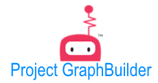
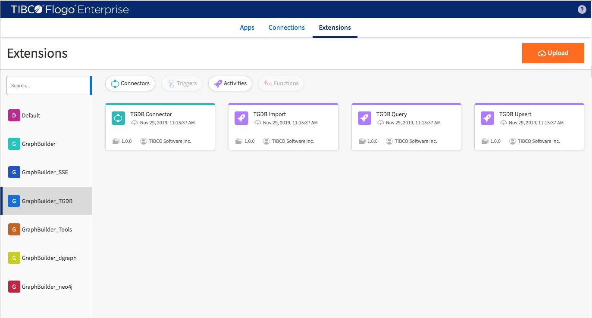

---
## Overview
Project GraphBuilder is a Flogo based tool set which includes couples of graph data processing related user extensions for TIBCO Flogo Enterprise. By using GraphBuilder you are able to build your own application to 
* Transform your data to desirded graph structure based upon your graph model.
* Insert graph into many major graph databases in the marcket (include TIBCO Graph Database, Dgraph, Neo4j and Janusgraph).
* Query and delete graph data against TIBCO Graph Database

## Getting Started
Download user extentions [here](/dist/) and import them to TIBCO Flogo Enterprise studio.

## Labs
* lab 1: Build an app to populate TIBCO Graph Database with data in csv files
* lab 2: Build an app to query against TIBCO Graph Database
* lab 3: Build an app to upsert real-time data to TIBCO Graph Database

## Components
* [GraphBuilder](./builder/)
* [GraphBuilder_TGDB](./tgdb/)
* [GraphBuilder_Dgraph](./dgraph/)
* [GraphBuilder_Neo4j](./neo4j/)
* [GraphBuilder_Gremlin](./gremlin/)
* [GraphBuilder_SSE](./sse/)
* [GraphBuilder_Tools](./tools/)

## Sample Applications
[Please refer to Here](./sample-applications/)
