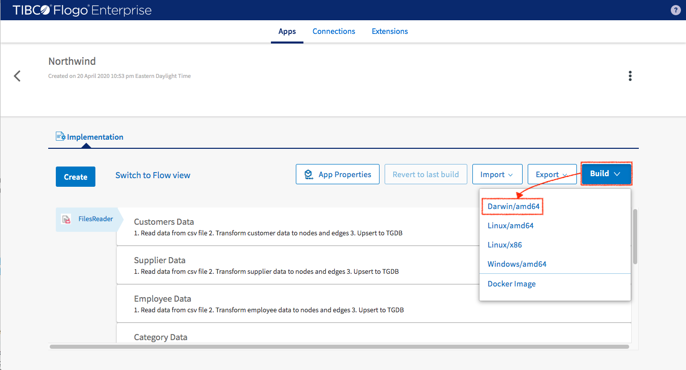
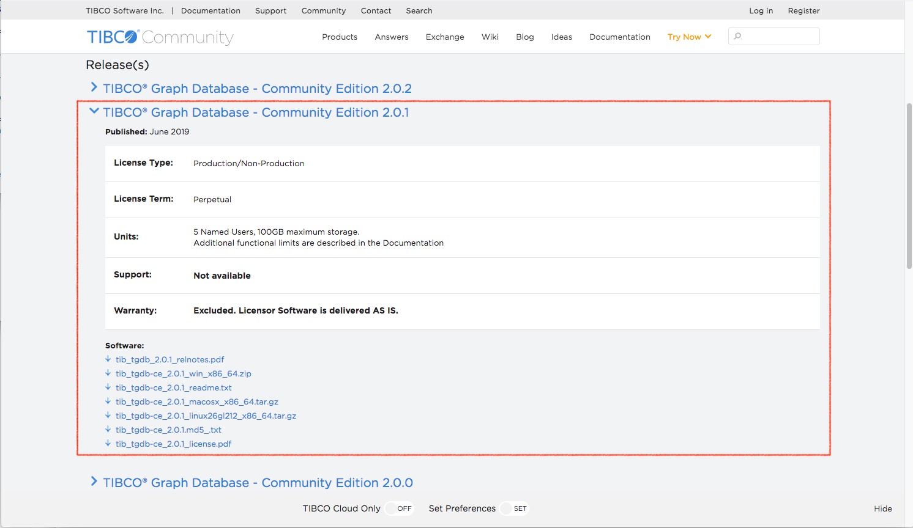
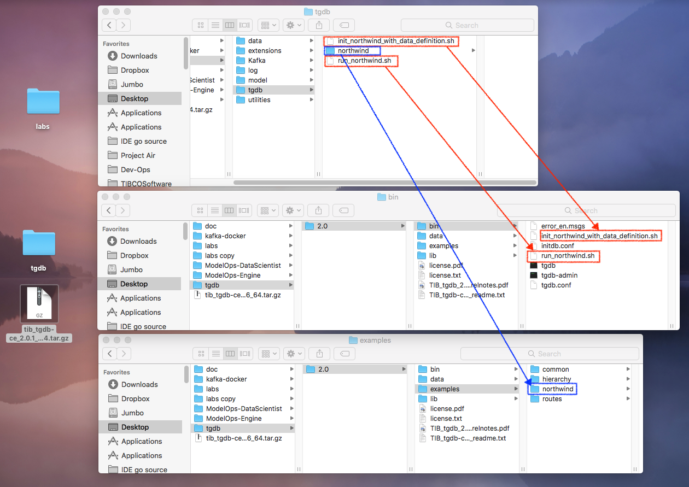
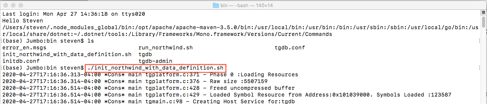
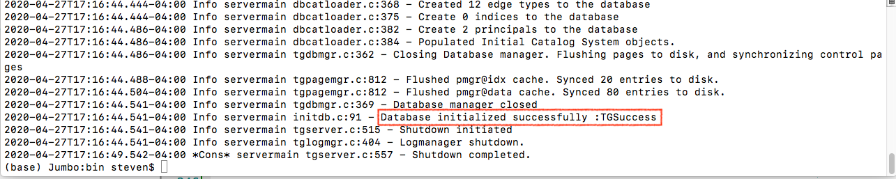
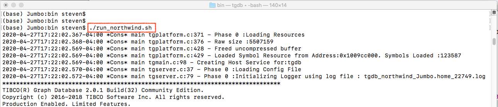
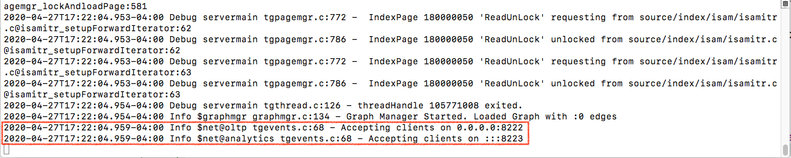
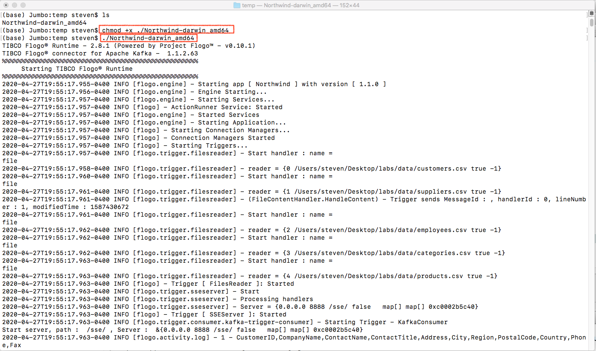
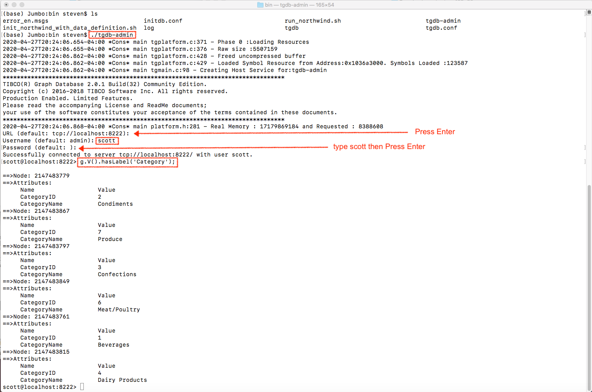

Let's start by building a graph model using the Northwind dataset. In the connection tab, select Graph to host graph model for the Flogo application.

In the dialog box
- Set model name
- Select “Local File”
- Select and upload northwind_model.json (Northwind model descriptor) from the ‘Download’ folder
- Click connect

The Northwind model descriptor file has been attached to the graph model 

Select ‘Apps’ tab and click ‘Create’ button to start building the first application

Name the application “Northwind” and then create it

Select ‘Create’ to build it from scratch

Flogo® Enterprise studio brings the dialog for creating the first flow. Based on the Northwind dataset, five flows are going to be created that will process the data from customers.csv, suppliers.csv, employees.csv, categories.csv and products.csv respectively. First step is building the customer data flow. 

In the empty flow panel, click “Flow Inputs & Outputs” vertical bar to generate data schema for current flow.

The flow starts by processing CSV data rows from a file one line at a time (to be set up in FileReader Trigger later on). A sample of useful data fields from incoming data need to be set. In the sample, the “FileContent” field represents a row of CSV data and the “LineNumber” field represents the current “sequence number” of the row in question.

Click the “Save” button so the schema generator of the studio converts the data sample into the schema definition.

Next, a trigger (data source of the flow) needs to be added by clicking “+” button on the left-hand side. Then select GraphBuilder_Tools -> FileReader trigger.

Filling the “Trigger Settings”
- Filename: point to the customers.csv in the ‘Download’ folder
- Asynchronous: set it to true so all the triggers for different data files could run simultaneously
- Emit per Line: set it to true so only one row of data is sent to the flow
- Max Number of Line: if it is set to negative, it means there will be no limit

Click “Save” to finish

Switch to “Map to Flow Inputs” and make the following mapping
- FileContent (defined in schema) -> $trigger.FileContent
- LineNumber (defined in schema) -> $trigger.LineNumber

Click “Save” button

Back to the flow to add first activity to the flow. Select GraphBuilder_Tools -> CSVParser to convert CSV text to system object.

Filling Settings:
- Date Format Sample: 2006-01-02 (Data format setup for underlining GOLang code)
- Serve Graph Data: set it to false since it is not going to be used
- Output Field Names: one line of setting for each data column. AttributeName is the attribute name in generated system object and CSVFieldName is the column name in CSV data row. Set optional to “false” for all key element fields. Click “Save” after finish configuring each line.
- First Row is Header: It can be set to true since the data file that is being used has a header

Click “Save” button

Switch to Inputs and map current input data to output data from upstream
- CSVString -> $flow.FileContent
- SequenceNumber -> $flow.LineNumber

Click “Save” when finishing it

Now the data has been transformed to the system object which could be recognized by the system. The next step is to convert plain object data to graph entities (nodes, edges and their attributes). We are going to use the core activity called “BuildGraph” to perform this transformation.

Let's select GraphBuilder -> Build Graph and configue it.

Filling setting
- Graph Model: Select “Northwind” connector which we just created. The “Northwind” graph model now associated with this activity which means BuildGraph activity take “Northwind” graph model to build the structure of its input data schema. This is seen during the setting of “Inputs” data mapping later.
- Allow Null Key: setting it to “true” will make it generate nodes (even when their primary key contains null elements).
- Batch Mode: set it to “false” since one data batch is processed each time.
- Pass Through Fields: leave it empty
- Modify Size of Instances: leave it empty, will be used in Employee data setup

Click “Save” button

Before input data can be mapped, take a look at the output schema of “CSVParser” (it's the upstream data for current “BuildGraph” activity). “CSVParser” has ability to handle multiple CSV rows, the output data structure is an array of object not just a single object.

In order to process the incoming data of array type, the iterator needs to be turned on to iterate through upstream output data (even though in this example there is only one element in the array). Following screenshot shows how to do it.

While mapping the input data, you may notice that the “Northwind” graph model has been brought to this activity as an input schema and the mapping target is not to “CSVParser” anymore but the local iteration. For the data coming from customers.csv, more than one type of nodes can be populated (which are defined in Northwind graph). Here is how the nodes (Customer, Company and Region) will be set

Customer node
- _skipCondition -> null==$iteration[value].CustomerID
- CustomerID -> $iteration[value].CustomerID
- CustomerName -> $iteration[value].CustomerName
- ContactName -> $iteration[value].ContactName
- ContactTitle -> $iteration[value].ContactTitle
- City -> $iteration[value].City
- RegionName -> $iteration[value].RegionName
- RegionCode -> $iteration[value].RegionCode
- Country -> $iteration[value].Country
- Phone -> $iteration[value].Phone
- Fax -> $iteration[value].Fax

Company node
- _skipCondition -> null==$iteration[value].CompanyID
- CompanyID -> $iteration[value].CompanyID
- CompanyName -> $iteration[value].CompanyName

Region node
- RegionName -> $iteration[value].RegionName
- Country -> $iteration[value].Country

Mapping for edge doesn’t need to be set up if there are no attributes for it (we don't configure “label” attribute for edges now since TGDB doesn't need it). BuildGraph activity is going to use the edge defined in graph model to create edge between nodes automatically.

After we convert data to graph entities, we can insert them to TIBCO® Graph Database. Let's create TIBCO® Graph Database connection first. In “Connections” tab select Add Connection -> TGDB Connector

In the dialog box enter the following information
- Connection name (for example “TGDB”)
- TGDB Server URL
- Username
- Password
- Keep Connection Alive: select “true”

Click “Connect” button

Now back to application's “Customer Data” flow to add TGDB activity. Select GraphBuilder_TGDB -> TGDBUpsert.

Filling Setting for
- TGDB connection: Select the “TGDB” Connection we just created
- Set Allow empty sting key to true (so a node with empty string key still get inserted)

Click “Save”

Map input data
- Graph{} - $activity[BuildGraph].Graph{}

Since the Graph object is immutable, you are not allowed to access the detail of its internal structure. 

A built-in “Log” activity can be inserted by following the next steps: 
Make room for “Log” activity by shifting activities one position to the right.

Add “Log” activity by select Default -> Log

Setup message for printing (you can apply built-in function to incoming data fields)
- message : string.concat(string.tostring($flow.LineNumber), " - “, $flow.FileContent)

You can write the entities (which are generated by BuildGraph activity) to file by adding GraphBuilder -> GraphtoFile activity

Specify the output folder and filename for GraphtoFile activity

Input data is and only can be Graph. The input setup same as TGDBUpsert

Congratulations, you have finished the first data flow for the application

Now you can follow the same steps to finish all the rest of flows

When you work on “Employee flow”, please pay attention to following steps.

In employee data there are two fields called EmployeeID and ReportTo each of them represents one individual employee. It implies that from the information of one employee data we can populate two employee nodes. One for employee himself/herself and the other one for his/her manager. We have to increase the instance of employee node for such data mapping.
- Modify size of instances: Add one entry for “Employee” node and set the number of instances to 2

Click “Save”

Switch to Inputs you will see two employee nodes appears (Employee0 and Employee1). Let's make Employee0 the employee (not manager) so all data can be populated to this node.

We make the Employee1 node represent the manager of Employee0 node so the only information we have for it (in the data) is “ReportTo” which will populate Employee1's EmployeeID.

Then we need to tell BuildGrap activity the relation between Employee0 and Employee1.

Now we can test Northwind application by sending data to it and then verifying if the data got inserted into TIBCO® Graph Database server

For building Northwind Flogo application, follow the next steps
1. In project, click “Build” button
2. Select the build target OS (in my case Darwin/amd64) then click to build

 

Once finished you can get your executable (Northwind-darwin_amd64) in the browser download folder

TIBCO® Graph Database needs to be set up next. Currently, Project GraphBuilder only supports TIBCO® Graph Database 2.0.1 (both Enterprise Edition and Community Edition are supported). You can get a Community version from <a href="http://community.tibco.com/products/tibco-graph-database" target="_blank">here</a>.

Follow the instructions in the download file to install TIBCO® Graph Database server and then copy the artifacts from the Download folder
- Northwind/tgdb/northwind -> tgdb/2.0/examples
- Northwind/tgdb/init_northwind_with_data_definition.sh -> tgdb/2.0/bin/
- Northwind/tgdb/run_northwind.sh -> tgdb/2.0/bin/

In Terminal switch to tgdb/2.0/bin folder then
- execute ./init_northwind_with_data_definition.sh to initialize tgdb with Northwind schema

- execute ./run_northwind.sh to run tgdb server

Open a new terminal and switch to the folder which contains Northwind application executable (Northwind-darwin_amd64).
- Change Northwind-darwin_amd64's permission to executable
- Run Northwind-darwin_amd64

Open a new Terminal and switch to TIBCO® Graph Database bin folder
- run tgdb-admin
- make query to get all categories

We've proved that data has been inserted to TIBCO® Graph Database server