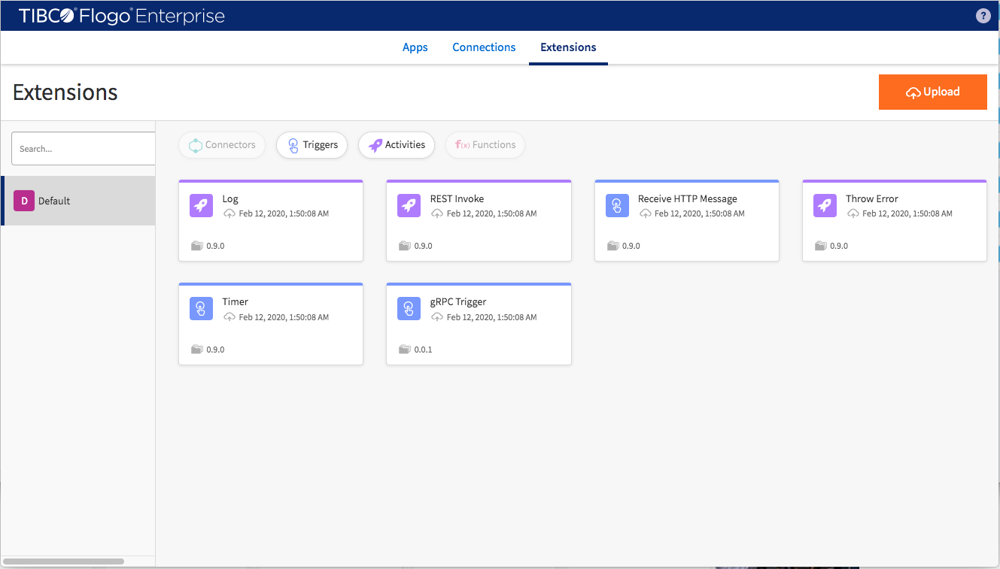
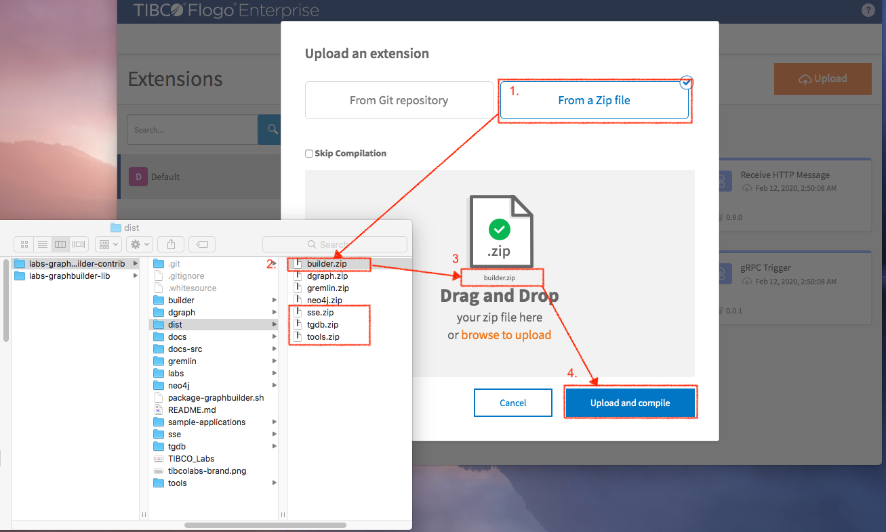
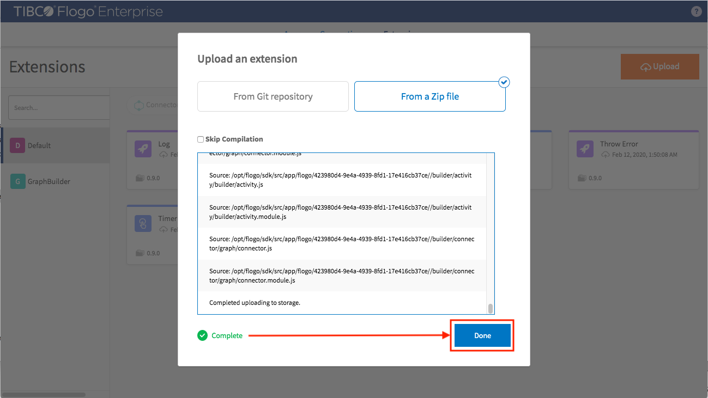
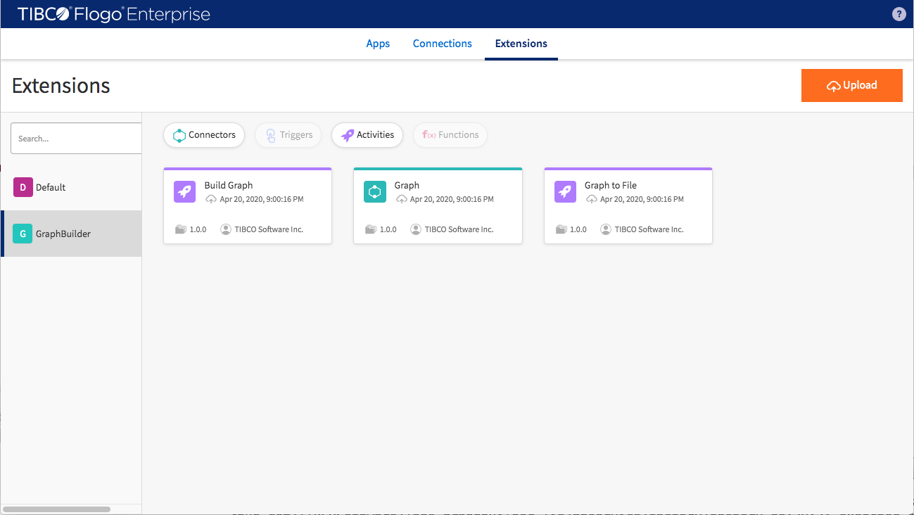
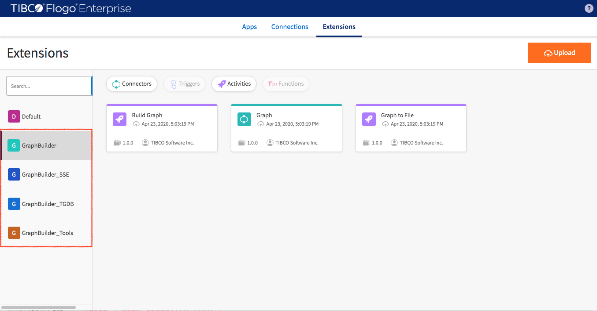

In following labs we are going to use the Northwind dataset to create an flogo application. The Northwind data is a sample dataset used by Microsoft to demonstrate the
features of Microsoft's relational database. We will demonstrate how to use GraphBuilder to convert relational data to graph then insert into TIBCO® Graph Database (TGDB).

You can check out or download Project GraphBuilder from https://https://github.com/TIBCOSoftware/labs-graphbuilder-contrib.gitlabs-graphbuilder-contrib.git. You can find the artifacts which you need for the labs project

- /TIBCOSoftware/labs-graphbuilder-contrib/dist : GraphBuilders user extensions
- /TIBCOSoftware/labs-graphbuilder-contrib/labs : Project data, graph model and TGDB configuration

In the labs we use TIBCO Flogo® Enterprise studio to configure the application. You need to have it installed before you can start building the application. 

Import all required user extensions files (builder.zip, tgdb.zip, tools.zip and sse.zip)
1. In "Extensions" tab click "Upload" button
2. Click "From a Zip file"
3. Select one user extension from dist folder (/TIBCOSoftware/labs-graphbuilder-contrib/dist)
4. Click "Upload and compiling"

Click "Done" when extension get uploaded and compiled

Uploaded extension will be display on left panel

Keep uploading all other required extensions. Here is all four required user extensions
- GraphBuilder
- GraphBuilder_TGDB
- GraphBuilder_Tools
- GraphBuilder_SSE

Now you are good to go for the upcoming labs

