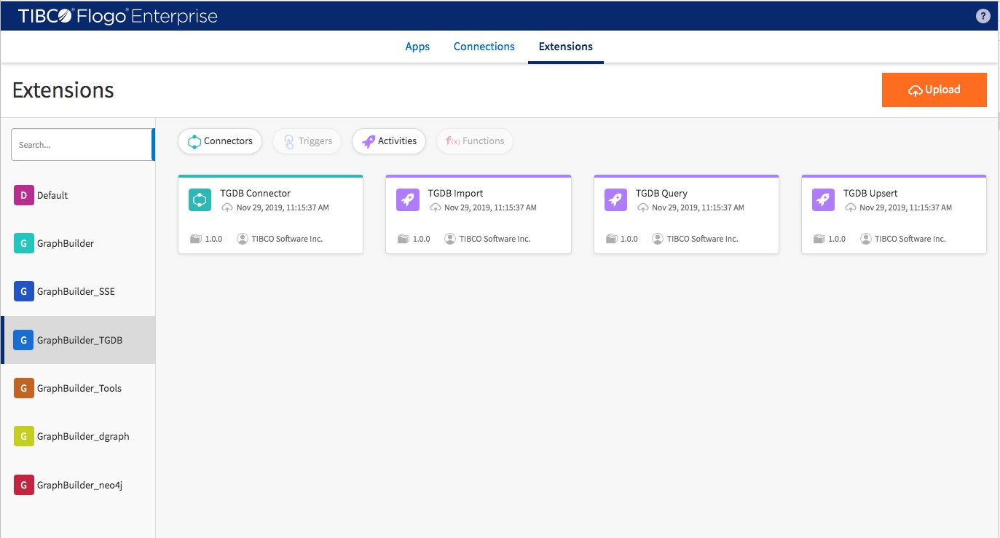

By using GraphBuilder you are able to build your own application to

- Transform your data to desirded graph structure based upon your graph model.
- Insert graph into many major graph databases in the marcket (include TIBCO Graph Database, Dgraph, Neo4j and Janusgraph).
- Query and delete graph data against TIBCO Graph Database

