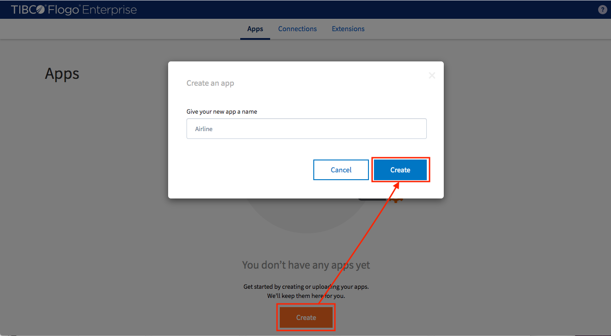
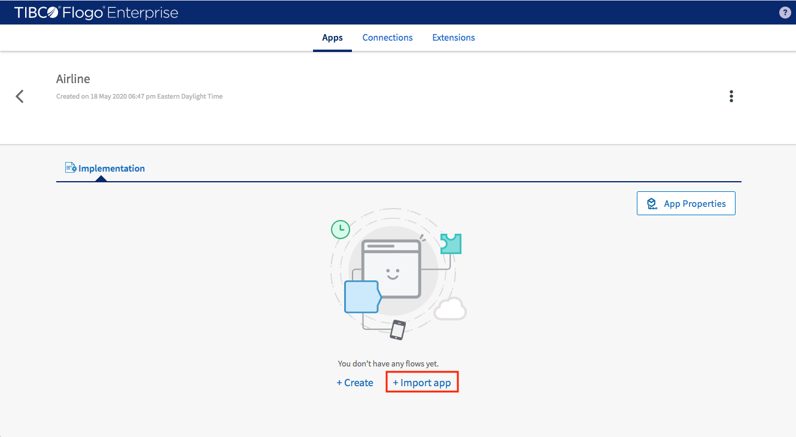
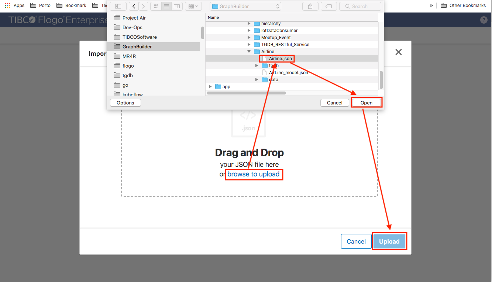
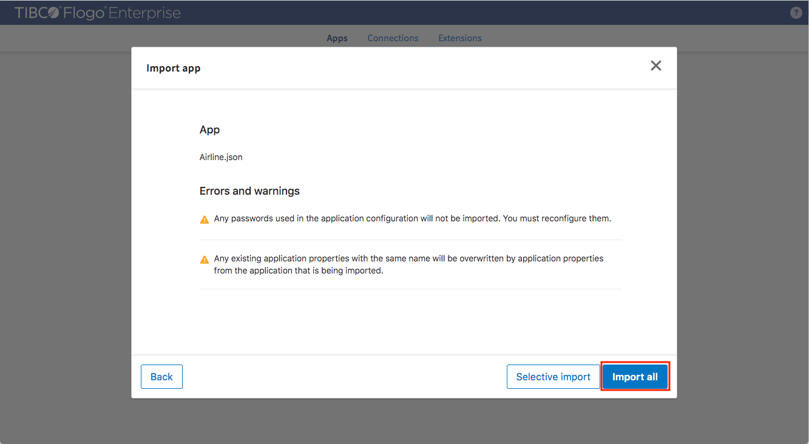
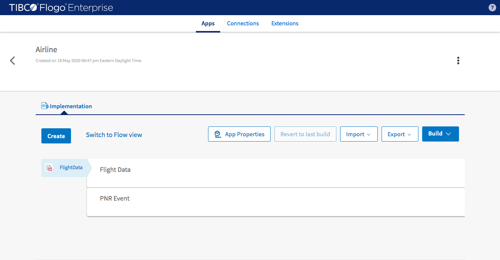
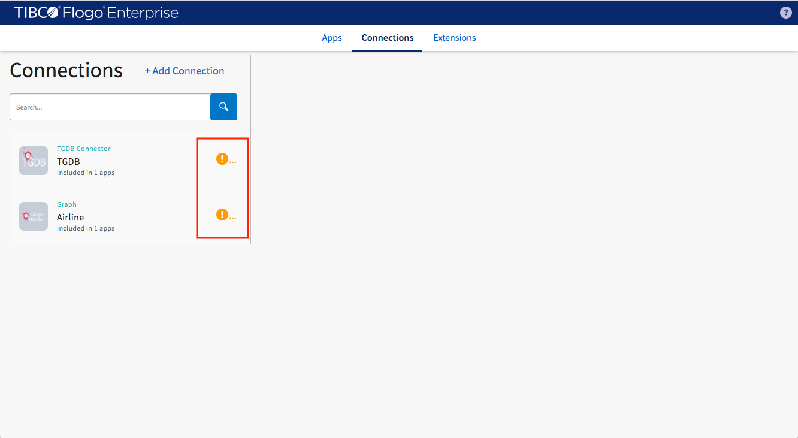
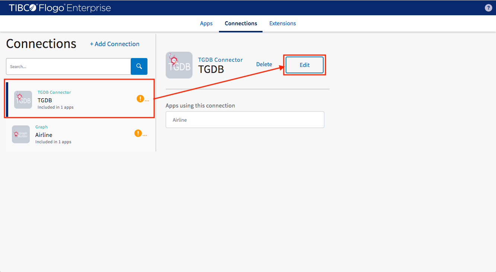
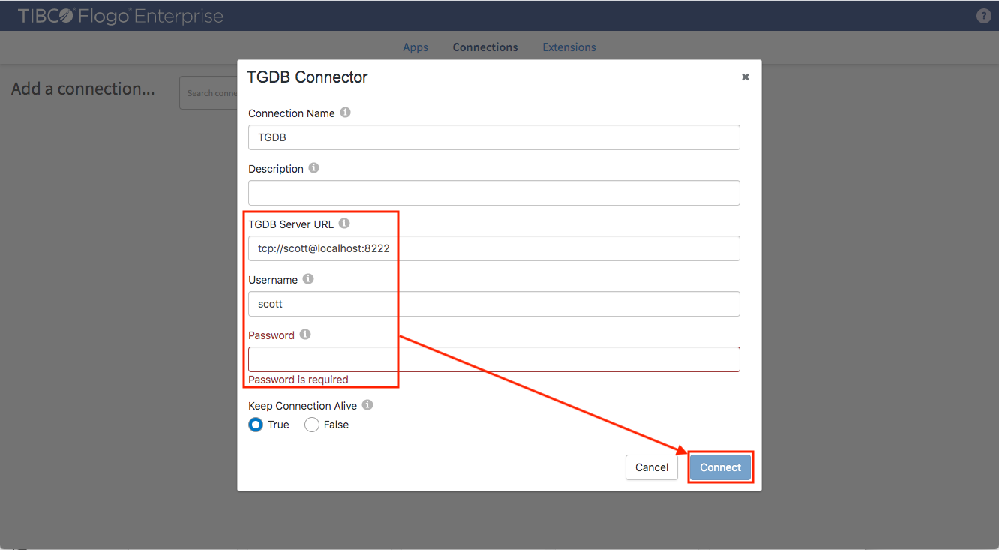
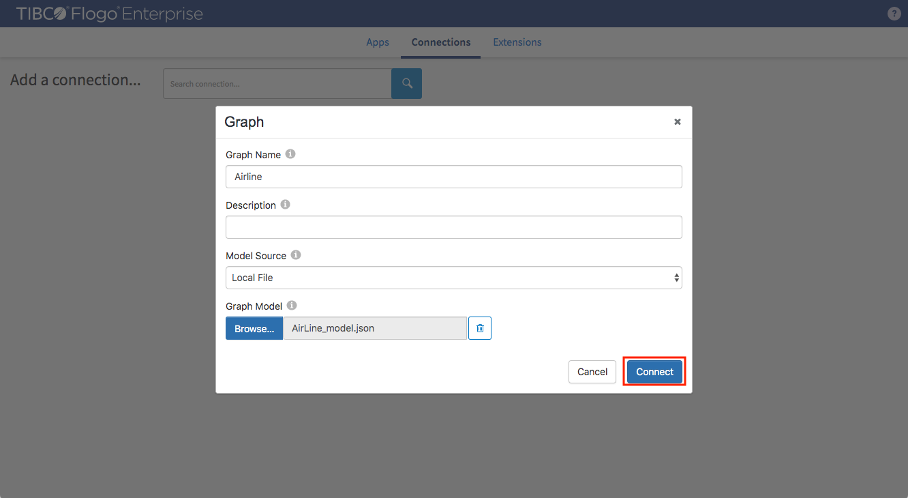

#### Implementation Source

Download application artifacts from [here](https://github.com/TIBCOSoftware/labs-graphbuilder-contrib/tree/master/sample-applications/Airline).

Download GraphBuilder user extensions from [here](https://github.com/TIBCOSoftware/labs-graphbuilder-contrib/blob/master/dist)

#### Installation

Open TIBCO Flogo® Enterprise 2.8.1 studio and upload required user extensions (builder.zip, tgdb.zip and tools.zip)

Create an empty application for Airline 

Import application from the pre-configured Airline application descriptor

Find and select descriptor (airline.json) from download folder

Ignore waning just click "Import All"

Airline application with two data flow (flight and pnr) is imported

Check connection tab to see two connections to be fixed

Select TGDB connection and edit it

Make configuration meet your TIBCO® Graph Database setup then click "Connect" to save it

Same to the Graph connection but just click "Connect" since graph model has been correctly set

> This example is created in TIBCO Flogo® Enterprise 2.8.1 studio.