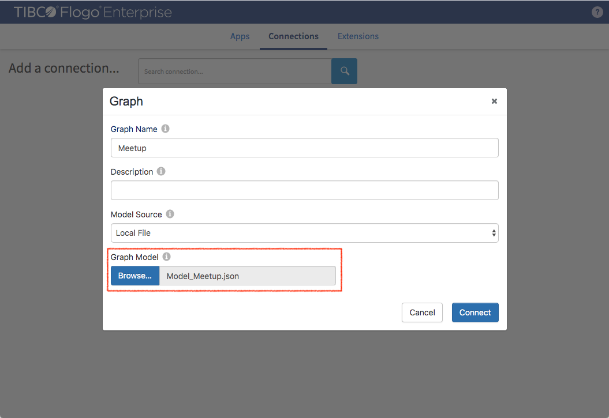
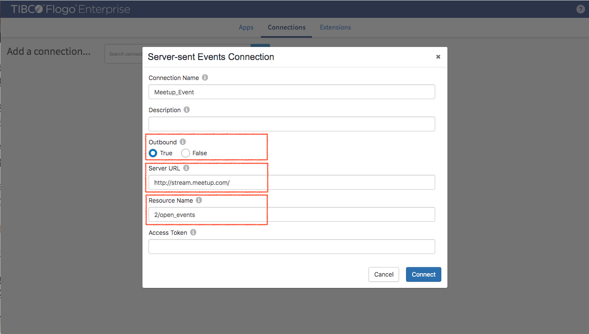
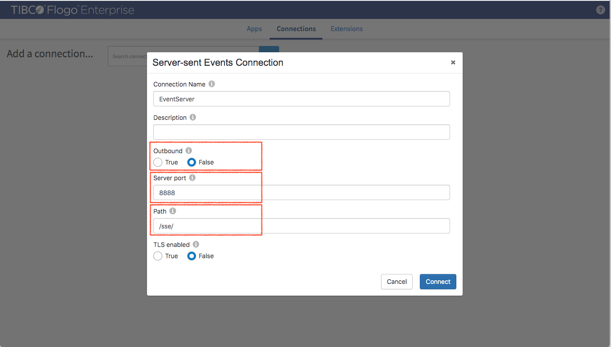
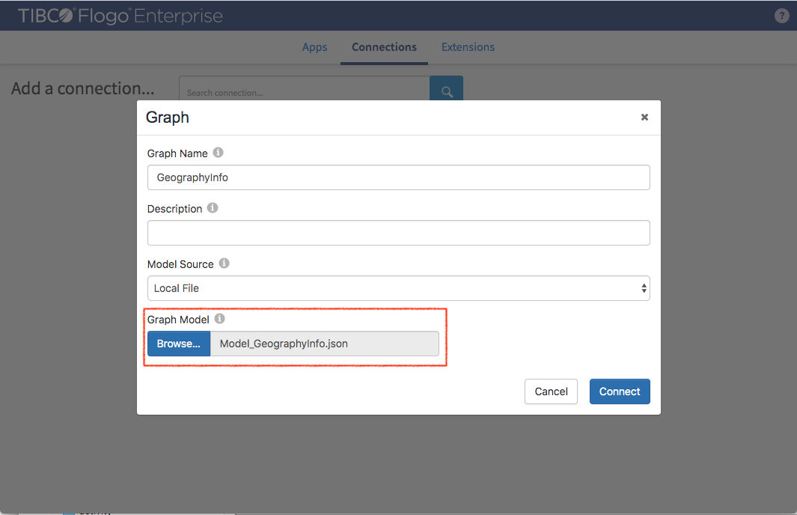
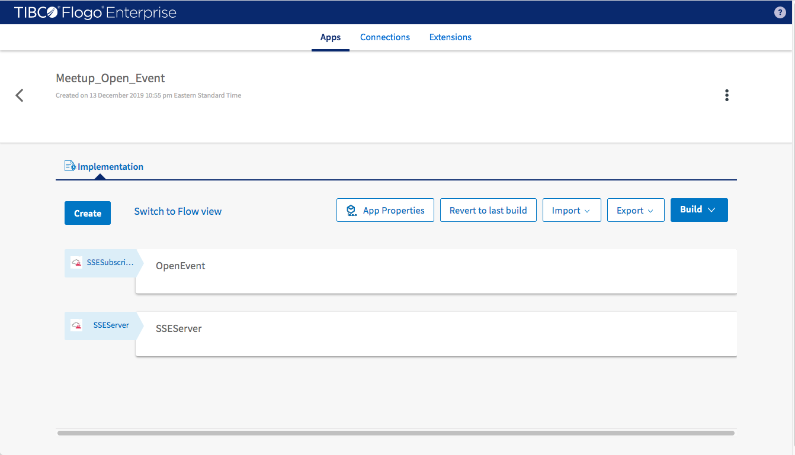
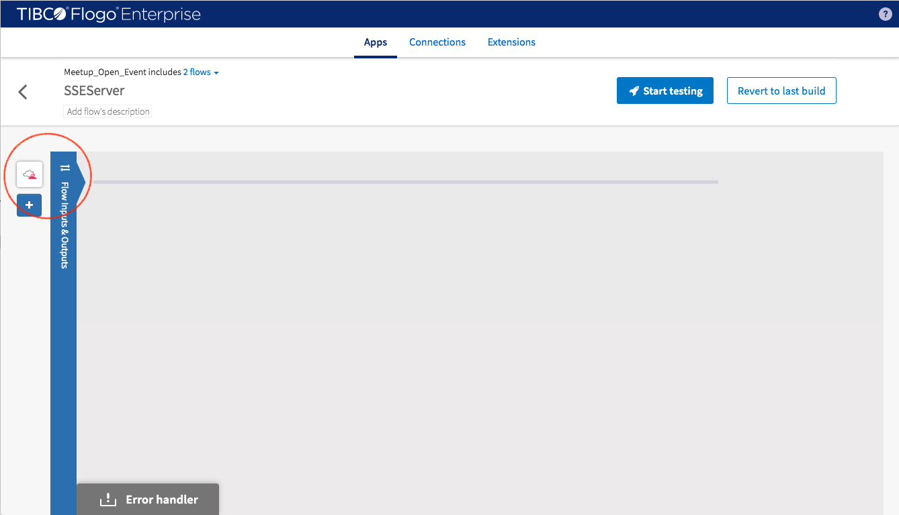
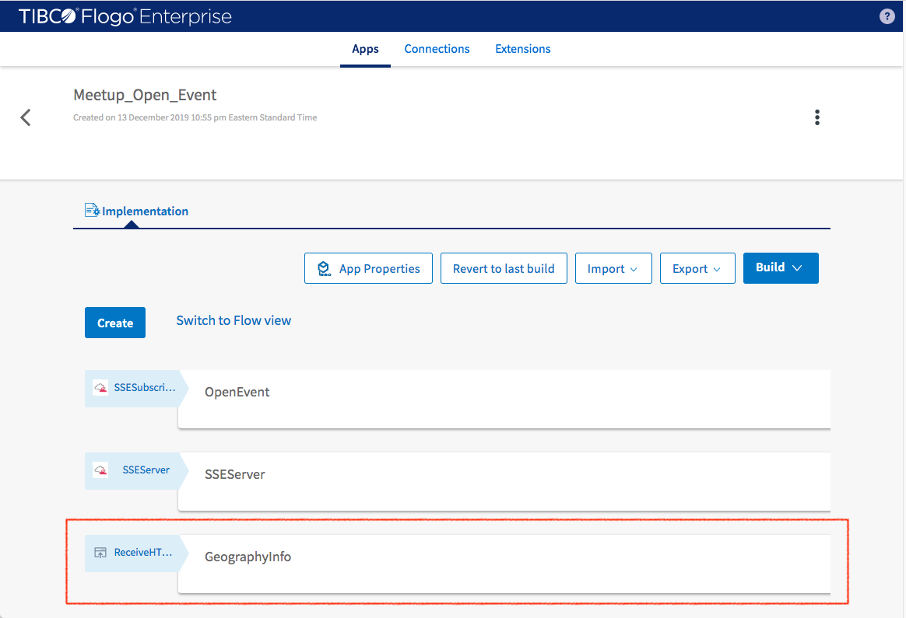
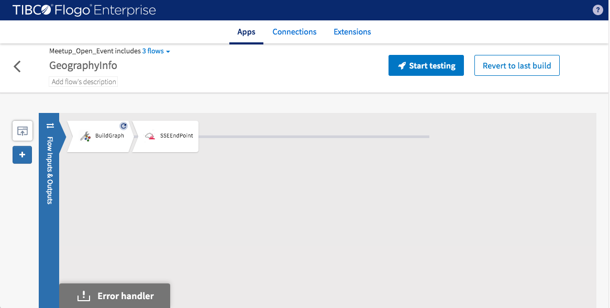

This example uses Meetup open event through Meetup API see https://www.meetup.com/meetup_api/

## Create Graph Model


### Setting
- **Graph Name:** -> Meetup
- **Model Source:** -> Select Local File
- **Graph Model:** -> Select sample-applications/Meetup_Event/Model_Meetup.json

## Create Connection for subscribing Meetup open event 


### Setting
- **Connection Name:** -> Meetup_Event
- **Outbound:** -> Sellect "true" for connecting to Meetup service
- **Server URL:** -> http://stream.meetup.com/
- **Resource Name:** -> 2/open_events
- **Access Token:** -> not required for accessing open event

## Create Connection for serving streaming graph data


### Setting
- **Connection Name:** -> EventServer
- **Outbound:** -> select "false" since it's a server
- **Server port:** -> any available port (8888 for this example)
- **Path:** -> /sse/ (client connect http://[host]:[port]/sse/meetup to subscribe "meetup" graph stream)

## Create GraphModel for Enriching Meetup Graph


### Setting
- **Graph Name:** -> GeographyInfo
- **Model Source:** -> Select Local File
- **Graph Model:** -> Select sample-applications/Meetup_Event/Model_GeographyInfo.json

## Create Application



### Create Flow for consuming Meetup open event 


#### Configure flow inputs and outputs

- **input sample** 
```
{
    "EventString" : ""
}
```
### Add Activity 1
Select GraphBuilder_Tools -> JSONDeserializer
- **JSON Data Sample:** -> Select sample-applications/Meetup_Event/.json
- **Default Values:** -> Set "na" as default for venue.address_1, category.name

### Add Activity 2
Select GraphBuilder_Builder -> BuildGraph
- **Graph Model:** -> Select "Meetup" (the connection we created previously)
- **Configure Model:** -> Map attributes to input data fields (for nodes and edges) 

### Add Activity 3-1
Select GraphBuilder_SSE -> SSEEndPoint
- **SSE Connection:** -> Select "EventServer" for serving streaming data(the connection we created previously)
- **Avtivity Input 1:** set StreamId to "meetup" (the resource name for client to subscribe)
- **Avtivity Input 2:** map required Data object to $activity[BuildGraph].Graph (output of BuildGraph activity)

### Add Activity 3-2
Select GraphBuilder_TGDB -> TGDBUpsert
- **TGDB Connection:** -> Select "TGDB" for upserting streaming data to TGDB(the connection we created in TGDB_RESTful_Service sample application)
- **Avtivity Input 1:** set required Graph object to $activity[BuildGraph].Graph

#### Add a trigger 
Select GraphBuilder_SSE -> SSESubscriber
- **SSE Connection(outbound request):** -> Select "Meetup_Event" for consuming open event from Meetup web site
- **Flow Input:** -> Map EventString to $trigger.Event (This is the output of SSESubscriber)

### Create Flow for Serving Streaming Graph Data 



#### Configure flow inputs and outputs

No configuration is required here since the data flow comes from SSEEndPoint of Meetup Event Flow directly

#### Add a trigger 
 GraphBuilder_SSE -> SSESubscriber
- **SSE Connection(inbound requests):** -> Select "EventServer" for serving streaming data(so now SSEEndPoint connected)
- **Flow Input:** -> Map EventString to $trigger.Event (This is the output of SSESubscriber)

- **Incoming Query**

HTTP GET with resource path /sse/{streamId}

- **reply**

$flow.queryResult

sample : 
```
{
 "graph":{
  "edges":{},
  "id":"GeographyInfo",
  "model":{
   "edges":{
    "attrTypeMap":{"in_Continent":{}},
    "directionMap":{"in_Continent":1},
    "keyMap":{"in_Continent":null},
    "types":["in_Continent"],
    "vertexes":{"in_Continent":["City","Continent"]}
   },
   "nodes":{
    "attrTypeMap":{"Continent":{"Name":"String"},"Country":{"Country_Code":"String"}},
    "keyMap":{"Continent":["Name"],"Country":["Country_Code"]},"types":["Country","Continent"]
   }
  },
  "modelId":"GeographyInfo",
  "nodes":{
   "Continent_0ecff3229a1a13980689def44b2c66e1":{
    "attributes":{"Name":{"name":"Name","type":"String","value":"North_America"}},
    "key":["North_America"],
    "keyAttributeName":["Name"],
    "type":"Continent"
   },
   "Country_5181a8acdef7be40dfbf3ec66bee2b20":{
    "attributes":{"Country_Code":{"name":"Country_Code","type":"String","value":"us"}},
    "key":["us"],
    "keyAttributeName":["Country_Code"],
    "type":"Country"
   }
  }
 }
}
```
### Create Flow for Enriching Meetup Graph 




#### Configure flow inputs and outputs

- **input sample** 
```
{
  "Continent": {
    "Name": "North_America",
    "Countries": [
      "us"
    ]
  }
}
```
### Add Activity 1
Select GraphBuilder_Builder -> BuildGraph
- **Graph Model:** -> Select "GeographyInfo" (the connection we created previously)
- **Configure Model:** -> Map attributes to input data fields (for nodes and edges) 

### Add Activity 2
Select GraphBuilder_SSE -> SSEEndPoint
- **SSE Connection:** -> Select "EventServer" for serving streaming data(the connection we created previously)
- **Avtivity Input 1:** set StreamId to "GeographyInfo" (the resource name for client to subscribe)
- **Avtivity Input 2:** map required Data object to $activity[BuildGraph].Graph (output of BuildGraph activity)

#### Add a trigger (Receive HTTP Message)

- **Setting1:** Set Port to any available one (in this sample 9998)
- **Setting2:** Set Method to "POST"
- **Setting3:** Set Path to "/geography/{Continent}"

- **Output Setting**

$trigger.pathParams.Continent
 and 
$trigger.body

body sample :
```
{
    "Countries": [
        "us"
    ]
}
```
- **Flow Input1:** Continent.Name map to $trigger.pathParams.Continent
- **Flow Input2:** Continent.Countries map to $trigger.body.Countries


#### Implementation Source
stored on GitHub [here](https://github.com/TIBCOSoftware/labs-graphbuilder-contrib/tree/master/sample-applications/Meetup_Event).

> This example is created in TIBCO Flogo® Enterprise 2.8.1 studio.