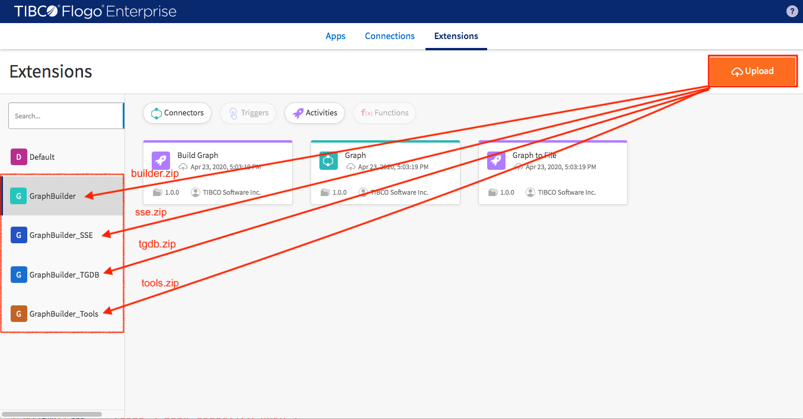

#### Implementation Source

Download application artifacts from [here](https://github.com/TIBCOSoftware/labs-graphbuilder-contrib/tree/master/sample-applications/Northwind).

Download GraphBuilder user extensions from [here](https://github.com/TIBCOSoftware/labs-graphbuilder-contrib/blob/master/dist)

#### Installation

Open TIBCO Flogo® Enterprise 2.8.1 studio and upload required user extensions (builder.zip, sse.zip, tgdb.zip and tools.zip)

Follow the [Airline](../airline) example to continue importing application

Create application from scratch see [labs](../../labs)

> This example is created in TIBCO Flogo® Enterprise 2.8.0 studio.