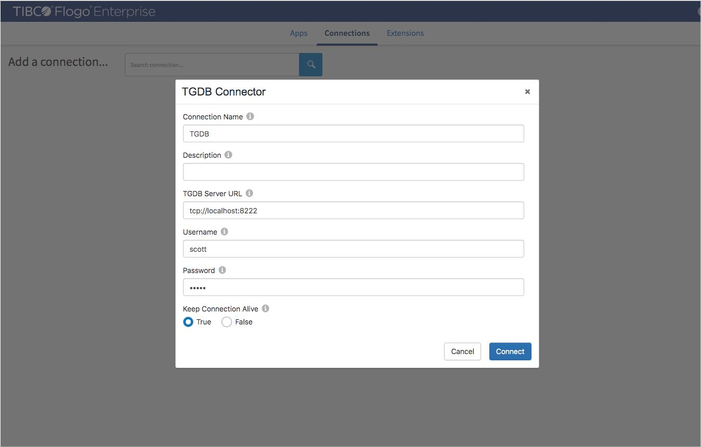
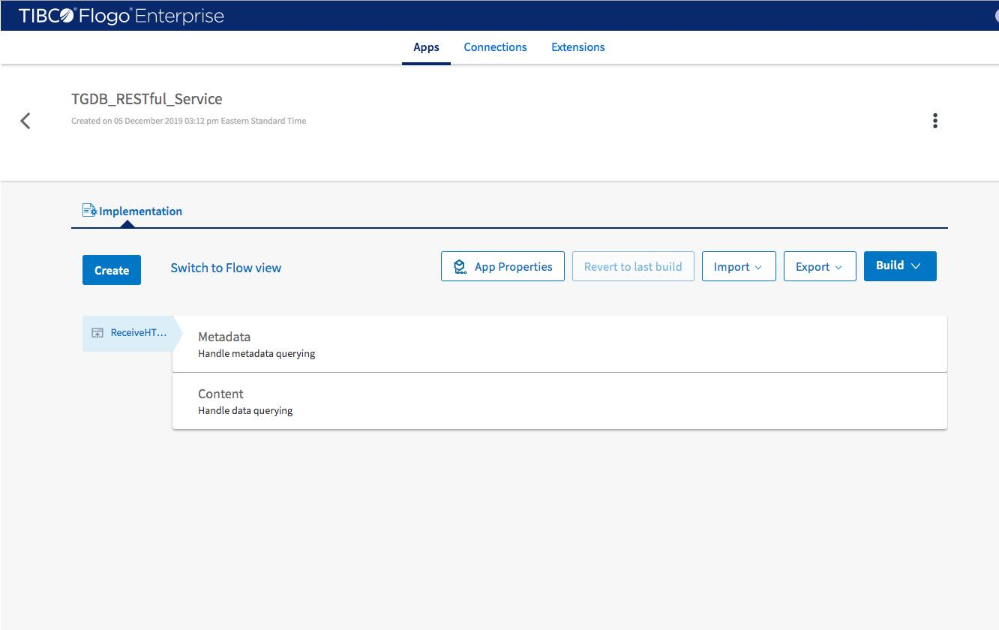

## Create TGDB Connection



## Create Application



### Create Flow for querying Metadata 

#### Configure flow inputs and outputs

- **input sample** 
```
{
    "queryType" : ""
}
```
- **output sample**
```
{
    "queryResult": {
        "content": {},
        "success": true,
        "error": {
            "code": 101,
            "message": "Not found"
        }
    }
}
```
#### Add activities

- **Activity 1 :**
GraphBuilder_TGDB -> TGDBQuery

- **Activity 2 :**
Default -> Return

#### Add a trigger (Receive HTTP Message)

- **output**

$trigger.pathParams.queryType

- **reply**

$flow.queryResult

sample : 
```
{
    "queryResult": {
        "content": {},
        "success": true,
        "error": {
            "code": 101,
            "message": "Not found"
        }
    }
}
```
### Create Flow for Querying Data 

#### Configure flow inputs and outputs

- **input sample**
```
{
    "queryType" : "",
    "language": "",
    "queryString": "",
    "traversalCondition": "",
    "endCondition": "",
    "traversalDepth": 1
}
```
- **output sample**
```
{
    "queryResult": {
        "content": {},
        "success": true,
        "error": {
            "code": 101,
            "message": "Not found"
        }
    }
}
```
#### Add activities

- **Activity 1 :**
GraphBuilder_TGDB -> TGDBQuery

- **Activity 2 :**
Default -> Return

#### Add a trigger (Receive HTTP Message)

- **output**

$trigger.pathParams.queryType
 and 
$trigger.body

sample :
```
{
  "query": {
  	"language" : "tgql",
    "queryString" : "@nodetype = 'houseMemberType' and memberName = 'Napoleon Bonaparte';",
    "traversalCondition" : "@edgetype = 'relation' and relation = 'spouse' and @isfromedge = 1 and @degree = 1;",
    "endCondition" : "",
	"traversalDepth" : 1
  }
}
```
- **reply**

$flow.queryResult

sample : 
```
{
    "queryResult": {
        "content": {},
        "success": true,
        "error": {
            "code": 101,
            "message": "Not found"
        }
    }
}
```


#### Implementation Source
stored on GitHub [here](https://github.com/TIBCOSoftware/labs-graphbuilder-contrib/tree/master/sample-applications/TGDB_RESTful_Service).

> This example is created in TIBCO Flogo® Enterprise 2.8.0 studio.